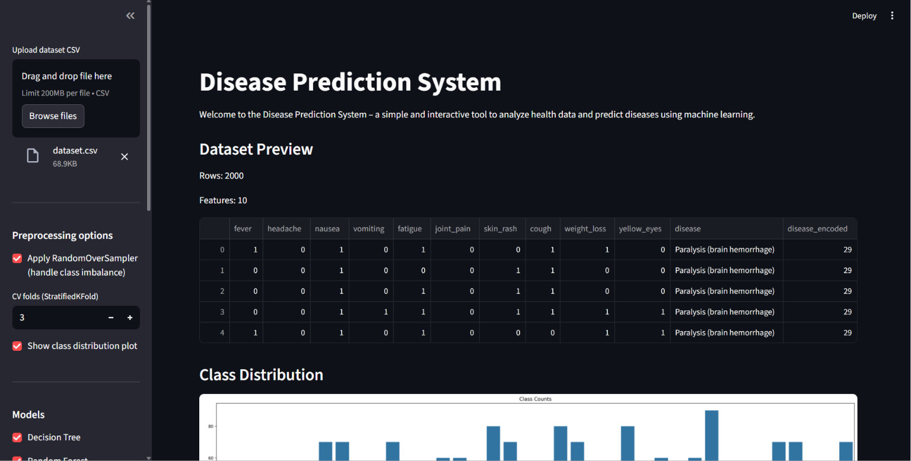
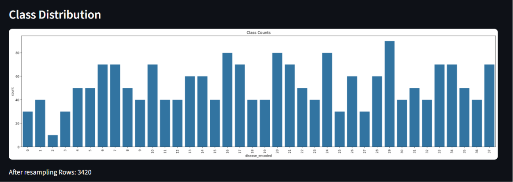
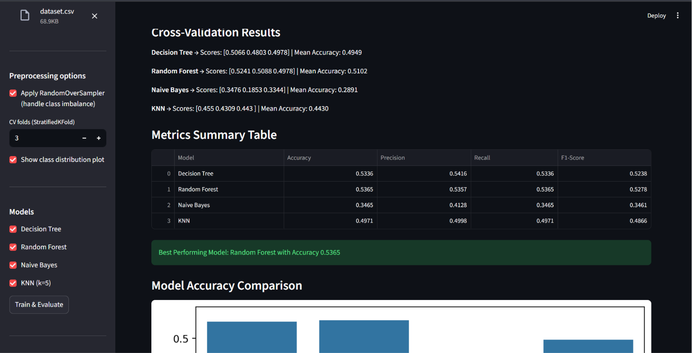
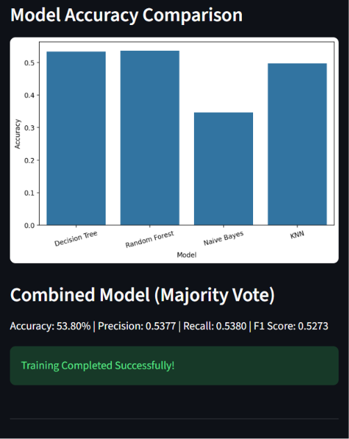
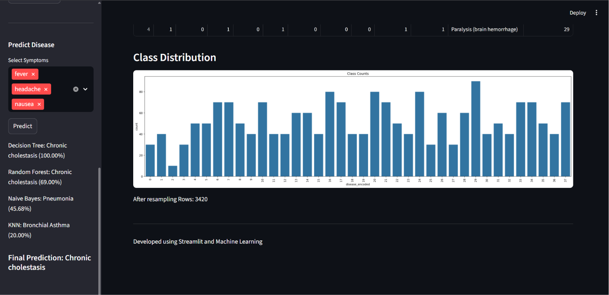

# 🩺 Disease Prediction System

**Disease Prediction System** is an interactive Machine Learning web application built using **Python** and **Streamlit** that predicts possible diseases based on symptom patterns present in the dataset. The project allows users to upload a dataset, train multiple machine learning models, compare their performance, and generate disease predictions using ensemble voting techniques.

This project demonstrates practical applications of **Machine Learning**, **Data Preprocessing**, **Model Evaluation**, and **Interactive Data Visualization** in the healthcare domain.

---

## ✨ Features

* 📂 **Dataset Upload:** Upload custom CSV datasets directly through the Streamlit interface.
* 🧹 **Data Preprocessing:** Automatic handling of missing values and label encoding.
* ⚖️ **Class Imbalance Handling:** Uses RandomOverSampler to balance disease classes.
* 📊 **Data Visualization:** Visual representation of disease class distribution.
* 🤖 **Multiple ML Models:** Train and compare different machine learning algorithms.
* 📈 **Cross-Validation:** Evaluate model performance using Stratified K-Fold Cross Validation.
* 📋 **Performance Metrics:** View Accuracy, Precision, Recall, and F1-Score for each model.
* 🏆 **Best Model Selection:** Automatically identifies the top-performing model.
* 🗳️ **Ensemble Voting:** Generates final predictions using majority voting.
* 🩺 **Disease Prediction:** Predict diseases based on selected symptoms.
* 🎨 **Interactive Dashboard:** User-friendly Streamlit interface for easy experimentation.

---

## 🛠️ Technologies Used

* 🐍 **Python** – Core programming language
* 🎈 **Streamlit** – Interactive web application framework
* 🐼 **Pandas** – Data manipulation and analysis
* 🔢 **NumPy** – Numerical computations
* 🤖 **Scikit-Learn** – Machine learning algorithms and evaluation
* ⚖️ **Imbalanced-Learn** – RandomOverSampler for class balancing
* 📊 **Matplotlib** – Data visualization
* 📈 **Seaborn** – Statistical plotting and charts

---

## 🤖 Machine Learning Models

The following models are implemented and compared:

* 🌳 Decision Tree Classifier
* 🌲 Random Forest Classifier
* 📐 Gaussian Naive Bayes
* 👥 K-Nearest Neighbors (KNN)

---

## 🔄 Project Workflow

1. Upload the dataset.
2. Perform preprocessing and label encoding.
3. Handle class imbalance using RandomOverSampler.
4. Split data into training and testing sets.
5. Train selected machine learning models.
6. Perform Stratified K-Fold Cross Validation.
7. Evaluate model performance.
8. Compare models using metrics and graphs.
9. Select symptoms for prediction.
10. Generate final disease prediction using majority voting.

---

## 📸 Project Screenshots

### 🏠 Home Page & Dataset Preview



### 📊 Class Distribution



### 📋 Model Evaluation Results



### 📈 Accuracy Comparison



### 🩺 Disease Prediction



---

## 🚀 Setup and Installation

### 1️⃣ Clone the Repository

```bash
git clone https://github.com/manika7105/Disease-Prediction-System.git
```

### 2️⃣ Navigate to Project Directory

```bash
cd Disease-Prediction-System
```

### 3️⃣ Install Required Libraries

```bash
pip install -r requirements.txt
```

### 4️⃣ Run the Application

```bash
streamlit run app.py
```

---

## 🧾 How to Use

1. Launch the Streamlit application.
2. Upload the dataset CSV file.
3. Configure preprocessing options.
4. Select machine learning models.
5. Click **Train & Evaluate**.
6. Analyze performance metrics and visualizations.
7. Choose symptoms from the sidebar.
8. Click **Predict** to get disease predictions.
9. View individual model predictions and the final ensemble prediction.

---

## 🔮 Future Improvements

* 🧠 Hyperparameter tuning for improved model performance.
* 📊 Advanced data visualization dashboard.
* ☁️ Cloud deployment for public accessibility.
* 🏥 Integration with larger real-world healthcare datasets.
* 📱 Mobile-friendly optimized interface.
* 🔬 Addition of advanced machine learning and deep learning models.

---

## ⚠️ Disclaimer

This project is developed for **educational and learning purposes only**. Predictions generated by the system should not be considered professional medical advice, diagnosis, or treatment recommendations.

---

## 👨‍💻 Author

**Manika Goel**

* GitHub: https://github.com/manika7105
* LinkedIn: https://www.linkedin.com/in/manika-goel-92201a286
* Email: goelmanika07@gmail.com

---

⭐ If you found this project useful, consider giving it a star on GitHub!
